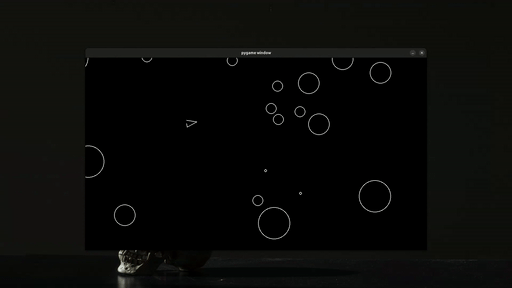

# Asteroids Game

This is a CLI clone of the classic Asteroids game built using Pygame and OOP concepts. It started as a guided project from the [boot.dev](https://www.boot.dev/) curriculum.

## Demo



## Installation
```bash
git clone git@github.com:abu-bilaall/boots-asteroid-game.git
cd boots-asteroid-game
uv sync # setup environment
uv run main.py # run game
```

## Gameplay
- w: move forward
- s: move backward
- d: turn left
- a: turn right
- space-bar: shoot

## License
This project is licensed under the Beer-ware License. See the [LICENSE](LICENSE) file for details.

## Potential Improvements
- Add a scoring system
- Implement multiple lives and respawning
- Add an explosion effect for the asteroids
- Add acceleration to the player movement
- Make the objects wrap around the screen instead of disappearing
- Add a background image
- Create different weapon types
- Make the asteroids lumpy instead of perfectly round
- Make the ship have a triangular hit box instead of a circular one
- Add a shield power-up
- Add a speed power-up
- Add bombs that can be dropped
